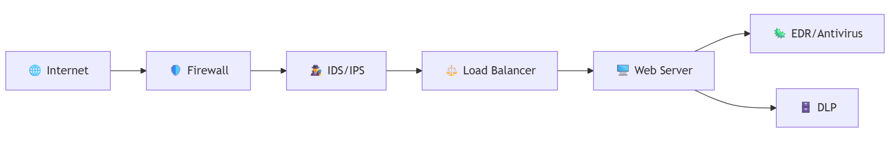
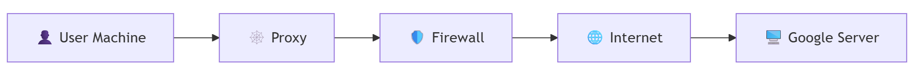
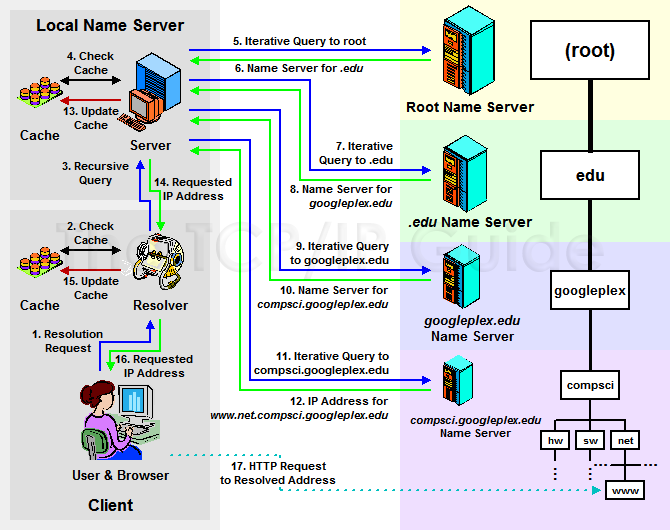
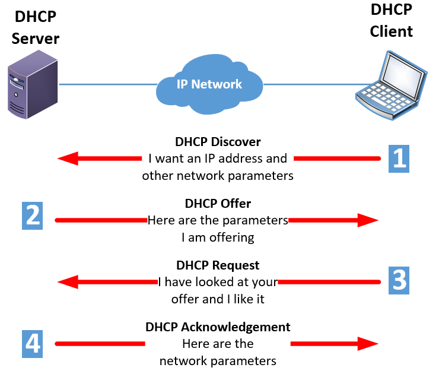

# 🛡️ Day 4: Networking and Security Concepts & IP Addressing
*Part of the [30-Day SOC Level 1 Series](https://cyber-security-center.github.io/SOC-30Days-Series/)*

Understanding how devices communicate over networks is essential for any SOC analyst. Today’s module covers the foundational networking concepts and IP addressing schemes that help analysts detect and respond to threats effectively.

---

## 📌 Topics & Subtopics

1. **What is Networking?**
2. **IP Addressing**
   - IPv4 vs IPv6
   - Public vs Private IPs
   - Subnetting
3. **Ports & Protocols**
   - TCP vs UDP
   - Common Ports (e.g., 80, 443, 22)
4. **Network Devices**
   - Routers, Switches, Load Balancers
5. **Security Devices**
   - IDS/IPS, SIEM, Firewalls, WAF, Antivirus, EDR, Proxy, DLP, Email Gateway 

---

## 🔍 Definitions & Examples

### 1. What is Networking?

📘 **Definition**: Networking is the practice of connecting computers and other devices to share resources and communicate using protocols.

🧠 **Example**: In a SOC, analysts monitor network traffic between internal systems and external servers to detect anomalies like data exfiltration.

_“Think of networking like a postal system—devices are houses, IP addresses are street addresses, and protocols are the rules for sending and receiving packages.”_

---

### Internet vs Intranet

#### Internet

📘 **Definition**: The Internet is a global network connecting millions of private, public, academic, business, and government networks. It enables worldwide communication and access to information.

🧠 **Example**: Browsing websites, sending emails, and accessing cloud services all use the Internet.

_“The Internet is like a massive public highway system—anyone can travel anywhere, but security is needed to protect travelers.”_

#### Intranet

📘 **Definition**: An Intranet is a private network accessible only to an organization’s staff. It uses internet technologies (like web browsers and protocols) but is isolated from the public Internet.

🧠 **Example**: Employees accessing internal HR portals, company documents, or collaboration tools via the organization’s intranet.

_“An intranet is like a private road within a company—only authorized personnel can use it, and it’s protected from outside traffic.”_

#### Quick Comparison Table

| Feature         | Internet                          | Intranet                          |
|-----------------|-----------------------------------|-----------------------------------|
| **Access**      | Public, global                    | Private, restricted to org users  |
| **Purpose**     | Global communication, info sharing| Internal communication, resources |
| **Security**    | Exposed, needs strong protection  | More secure, behind firewalls     |
| **Examples**    | Google, Facebook, Email           | HR portal, internal wiki          |

> **SOC Relevance:**  
SOC analysts monitor both Internet and intranet traffic. Internet-facing systems are more exposed to threats, while intranet monitoring helps detect insider threats and unauthorized access.


---

### 2. IP Addressing

📘 **Definition**: An IP (Internet Protocol) address is a unique identifier assigned to each device on a network, allowing it to send and receive data.

🧠 **Example**: A SOC analyst might investigate suspicious traffic from a private IP (e.g., 192.168.1.10) trying to connect to a known malicious public IP.

_“An IP address is like a phone number—each device has one so others can reach it directly.”_

#### IPv4 vs IPv6

📘 **Definition**: IPv4 uses 32-bit addresses (e.g., 192.168.1.1), while IPv6 uses 128-bit addresses (e.g., 2001:0db8:85a3::8a2e:0370:7334) to support more devices.

🧠 **Example**: IPv6 is increasingly used in modern networks, and SOC tools like Wireshark can capture both IPv4 and IPv6 traffic.

_“IPv4 is like a small town with limited house numbers; IPv6 is a mega city with endless addresses.”_

#### Public vs Private IPs

📘 **Definition**: Public IPs are routable on the internet, while private IPs are used within internal networks and are not directly accessible from outside.

#### Quick Comparison: Private vs Public IP Addresses

| Feature            | Private IP Address                          | Public IP Address                          |
|--------------------|---------------------------------------------|--------------------------------------------|
| **Usage**          | Internal networks (LAN, home, office)       | Internet-facing, accessible globally       |
| **Accessibility**  | Not reachable from the internet             | Reachable from anywhere on the internet    |
| **IP Ranges**      | 10.0.0.0 – 10.255.255.255<br>172.16.0.0 – 172.31.255.255<br>192.168.0.0 – 192.168.255.255 | Any IP outside private ranges              |
| **Assigned By**    | Network administrator or DHCP server        | ISP (Internet Service Provider)            |
| **Security**       | More secure, hidden from external threats   | Exposed, needs protection (firewall, etc.) |
| **Example**        | 192.168.1.10                                | 8.8.8.8                                    |

> **Interview Tip:** Private IPs are used for internal communication and cannot be routed on the internet, while public IPs are used for devices that need to be accessible from outside the local network.

🧠 **Example**: SOC analysts often monitor traffic from private IPs to public IPs to detect unauthorized data transfers.

_“Private IPs are like internal office extensions; public IPs are direct phone lines to the outside world.”_

#### Classes of IP Addresses

IP addresses are divided into five classes (A, B, C, D, E) based on their leading bits and intended use:

| Class | Range (First Octet) | Default Subnet Mask | Usage                     |
| ----- | ------------------- | ------------------- | ------------------------- |
| A     | 1 – 126             | 255.0.0.0           | Large networks            |
| B     | 128 – 191           | 255.255.0.0         | Medium-sized networks     |
| C     | 192 – 223           | 255.255.255.0       | Small networks            |
| D     | 224 – 239           | N/A                 | Multicast (not for hosts) |
| E     | 240 – 255           | N/A                 | Experimental/Reserved     |

> Note: 127.x.x.x is reserved for loopback addresses and not used for host assignment.

#### Other Special IP Ranges

- **Loopback:** 127.0.0.0 – 127.255.255.255 (commonly 127.0.0.1, used for testing on the local machine)
- **Link-local (APIPA):** 169.254.0.0 – 169.254.255.255 (automatically assigned if DHCP fails)
- **Reserved:** 0.0.0.0/8 (used for default routes), 240.0.0.0 – 255.255.255.254 (reserved for future use)
- **Broadcast:** 255.255.255.255 (used to send messages to all hosts on a network)

_“Think of private IPs as internal office numbers, public IPs as external phone numbers, loopback as calling yourself, and link-local as a fallback number when the main system fails.”_

#### Quick Overview: IPv6

IPv6 (Internet Protocol version 6) is the successor to IPv4, designed to address the limitations of IPv4’s address space. It uses 128-bit addresses, allowing for approximately 340 undecillion unique IPs—enough for every device on earth and beyond.

**Why IPv6 is Needed Over IPv4:**  
IPv4’s 32-bit address space supports about 4.3 billion unique addresses, which is insufficient for today’s global demand driven by mobile devices, IoT, and cloud services. IPv6 solves this shortage, enabling continued internet growth and connectivity.

**Key Features:**
- **Address Format:** Eight groups of four hexadecimal digits (e.g., `2001:0db8:85a3:0000:0000:8a2e:0370:7334`)
- **No Need for NAT:** Vast address space eliminates the need for Network Address Translation.
- **Built-in Security:** Supports IPsec for end-to-end encryption and authentication.
- **Simplified Header:** More efficient packet processing.

**SOC Relevance:**  
SOC analysts should be familiar with IPv6 traffic, as attackers may use it to bypass legacy security controls. Monitoring both IPv4 and IPv6 is essential for comprehensive network visibility.

_“IPv6 is like expanding from a small town to a global metropolis—there’s room for everyone, but new rules apply.”_

---

#### Subnetting

📘 **Definition**: Subnetting divides a network into smaller segments to improve performance and security.

🧠 **Example**: A SOC analyst may investigate traffic between subnets to detect lateral movement by attackers.

_“Subnetting is like dividing a building into departments—each has its own space but can still communicate.”_

#### Subnetting Explained for Beginners

Subnetting is the process of splitting a large network into smaller, more manageable pieces called subnets. This helps organize networks, improve security, and reduce congestion.

**Why Subnet?**
- To separate departments (e.g., HR, IT, Finance) so issues in one don’t affect others.
- To limit broadcast traffic and improve performance.
- To enhance security by isolating sensitive systems.

**Simple Example:**
Suppose you have a company with the network 192.168.1.0/24 (which allows 254 devices). You want to split it into two groups: one for staff and one for guests.

- **Subnet 1:** 192.168.1.0/25 (devices 192.168.1.1 – 192.168.1.126)
- **Subnet 2:** 192.168.1.128/25 (devices 192.168.1.129 – 192.168.1.254)

Now, staff and guests are on separate subnets, making it easier to manage and secure each group.

**Analogy:**  
_Think of subnetting like dividing a large apartment building into separate floors. Each floor (subnet) has its own set of apartments (devices), making it easier to manage mail delivery and security._

**CIDR Notation:**  
Subnetting often uses CIDR (Classless Inter-Domain Routing) notation, like `/24` or `/25`, to specify how many bits are used for the network part of the address.

| Subnet Mask     | CIDR | Number of Hosts |
| --------------- | ---- | --------------- |
| 255.255.255.0   | /24  | 254             |
| 255.255.255.128 | /25  | 126             |
| 255.255.255.192 | /26  | 62              |

**SOC Relevance:**  
SOC analysts may investigate suspicious activity moving between subnets, which could indicate an attacker trying to access different parts of the network.


---

### 3. Ports & Protocols

📘 **Definition**: Ports are logical endpoints for communication, and protocols define the rules for data exchange.

🧠 **Example**: Port 443 is used for HTTPS traffic. If malware communicates over this port, it may evade detection unless inspected deeply.

_“Ports are like doors in a building—each one leads to a specific service, and protocols are the rules for using those doors.”_

#### Understanding Port Ranges for Beginners

Ports are numbered from 0 to 65535 and are grouped into different ranges based on their usage and reservation status:

| Range            | Port Numbers  | Description                                   |
| ---------------- | ------------- | --------------------------------------------- |
| Well-known Ports | 0 – 1023      | Reserved for common protocols and services    |
| Registered Ports | 1024 – 49151  | Assigned for user or vendor-specific services |
| Dynamic/Private  | 49152 – 65535 | Used for temporary or private connections     |

**Reserved Ports:**  
Ports 0–1023 are reserved for system or widely-used services (e.g., HTTP, HTTPS, SSH).

**Non-Reserved Ports:**  
Ports 1024–65535 can be used by applications and are not reserved for specific services.

#### Top Common Ports Seen in SOC Environments

| Port | Protocol | Service     | Typical Use Case          |
| ---- | -------- | ----------- | ------------------------- |
| 20   | TCP      | FTP Data    | File transfers            |
| 21   | TCP      | FTP Control | File transfers            |
| 22   | TCP      | SSH         | Secure remote login       |
| 23   | TCP      | Telnet      | Unsecured remote login    |
| 25   | TCP      | SMTP        | Email sending             |
| 53   | UDP/TCP  | DNS         | Domain name resolution    |
| 80   | TCP      | HTTP        | Web traffic (unencrypted) |
| 110  | TCP      | POP3        | Email retrieval           |
| 143  | TCP      | IMAP        | Email retrieval           |
| 443  | TCP      | HTTPS       | Secure web traffic        |
| 3389 | TCP      | RDP         | Remote Desktop Protocol   |

> **SOC Tip:** Attackers may use common ports (like 80 or 443) to disguise malicious traffic. Monitoring both reserved and non-reserved ports helps analysts spot unusual activity.

_Think of well-known ports as main entrances to a building (everyone knows them), while higher-numbered ports are like side doors or temporary access points._

#### IP, TCP, and UDP: Protocols Explained

##### What is IP?

📘 **Definition**: IP (Internet Protocol) is the fundamental protocol that assigns unique addresses to devices and routes data packets between them across networks.

🧠 **Example**: When you visit a website, your device uses IP to find and communicate with the web server’s address.

_“IP is like the addressing system for mail—every device gets a unique address so data knows where to go.”_

---

#### TCP vs UDP

📘 **Definition**: TCP (Transmission Control Protocol) and UDP (User Datagram Protocol) are two main transport protocols. TCP is connection-oriented and reliable, ensuring data arrives correctly and in order. UDP is connectionless, faster, but less reliable, sending data without guarantees.

🧠 **Example**: DNS uses UDP for quick lookups; SOC tools monitor both TCP and UDP traffic for anomalies.

_“TCP is like sending registered mail with tracking; UDP is like dropping a postcard in the mailbox.”_

---

#### Comparison: TCP vs UDP

| Feature            | TCP (Transmission Control Protocol)                                 | UDP (User Datagram Protocol)                   |
| ------------------ | ------------------------------------------------------------------- | ---------------------------------------------- |
| **Connection**     | Connection-oriented (establishes a connection before data transfer) | Connectionless (no setup required)             |
| **Reliability**    | Reliable (guarantees delivery, retransmits lost packets)            | Unreliable (no guarantee of delivery or order) |
| **Ordering**       | Ensures data arrives in order                                       | No ordering; packets may arrive out of order   |
| **Error Checking** | Yes (error detection and correction)                                | Yes (error detection only, no correction)      |
| **Speed**          | Slower due to overhead                                              | Faster, minimal overhead                       |
| **Use Cases**      | Web browsing (HTTP/HTTPS), email (SMTP), file transfer (FTP)        | Streaming, VoIP, DNS, online gaming            |
| **Header Size**    | Larger (20 bytes minimum)                                           | Smaller (8 bytes)                              |
| **Flow Control**   | Yes                                                                 | No                                             |

---
#### Protocols Overview

| Protocol | Layer in OSI Model  | Function                                                                     |
| -------- | ------------------- | ---------------------------------------------------------------------------- |
| **IP**   | Layer 3 (Network)   | Provides logical addressing and routing of packets between devices/networks. |
| **TCP**  | Layer 4 (Transport) | Ensures reliable, ordered, and error-checked delivery of data.               |
| **UDP**  | Layer 4 (Transport) | Enables fast, connectionless, and unreliable data transfer.                  |

> **Note:** IP is responsible for addressing and routing, while TCP and UDP handle how data is transported between endpoints.
> 
---

### 4. Network Devices

📘 **Definition**: Network devices are hardware or software components that facilitate, manage, and optimize the flow of data across networks.

🧠 **Example**: In a SOC, analysts may monitor logs from routers and load balancers to identify unusual traffic patterns or potential attacks.

_“Routers are like traffic cops directing cars between highways, switches are intersection managers within a city, and load balancers are organizers that distribute cars evenly across multiple lanes.”_

#### Common Network Devices

- **Router**
    - Connects different networks (e.g., home network to the internet).
    - Routes data packets based on IP addresses.
    - Can perform Network Address Translation (NAT) to allow multiple devices to share a single public IP.

- **Switch**
    - Connects devices within the same local area network (LAN).
    - Forwards data based on MAC addresses.
    - Reduces congestion by sending data only to the intended recipient.

- **Load Balancer**
    - Distributes incoming network traffic across multiple servers.
    - Ensures no single server becomes overwhelmed, improving performance and reliability.
    - Can help defend against certain types of attacks (e.g., DDoS) by spreading out the load.

**Key Differences:**
- Routers operate at Layer 3 (Network), switches at Layer 2 (Data Link), and load balancers typically at Layer 4 (Transport) or Layer 7 (Application).
- Routers connect networks, switches connect devices within a network, and load balancers optimize resource usage across servers.

---

### 5. Security Devices

📘 **Definition**: Security devices are specialized tools designed to detect, prevent, and respond to threats by monitoring and controlling network traffic.

🧠 **Example**: SOC analysts use SIEMs to correlate alerts from firewalls, IDS/IPS, and endpoint security tools to identify coordinated attacks.

_“Firewalls are security guards at the gate, IDS/IPS are surveillance cameras, SIEMs are the central command center, and proxies are intermediaries that check credentials before letting anyone in.”_

#### Common Security Devices

#### Common Security Devices (in Tablaluar format)

| Device | Real World Analogy | Purpose & OSI Layer | Deployment | Use Cases | Key Fields to Investigate | Popular Vendors |
|--------|--------------------|---------------------|-----------------------------|------------|--------------------------|-----------------|
| **Firewall** | Like a security guard at a building entrance, checking who can enter or leave. | - Monitors and filters network traffic based on security rules. <br> - Operates at OSI Layer 3 (Network) and Layer 4 (Transport). | - Hardware or software. <br> - Deployed inline with network traffic. | - Detecting too many denied/allowed connections<br>- Blocking traffic from suspicious countries<br>- Monitoring firewall configuration changes<br>- Investigating excessive VPN access failures<br>- Identifying communication with known bad IPs | - Source IP (src_ip)<br>- Destination IP (dst_ip)<br>- Source Port (src_port)<br>- Destination Port (dst_port)<br>- Action (action)<br>- Protocol (protocol)<br>- Rule/Policy ID (rule_id / policy_id)<br>- Timestamp (timestamp)<br>- Interface (interface) | - Palo Alto Networks<br>- Fortinet (FortiGate)<br>- Cisco Firepower<br>- Check Point<br>- Juniper SRX |
| **IDS/IPS** | Like a security alarm system that detects break-ins (IDS) or automatically locks doors to stop intruders (IPS). | - IDS detects suspicious activity and alerts. <br> - IPS blocks/prevents threats in real time. <br> - Operates at Layer 3 and 4. | - Hardware or software. <br> - IDS is passive. <br> - IPS is deployed inline. | - Detecting high-severity attacks on multiple machines<br>- Identifying repeated attacks from a single public IP<br>- Alerting on new/unknown attack patterns<br>- Monitoring for lateral movement | - Source IP (src_ip)<br>- Destination IP (dst_ip)<br>- Source Port (src_port)<br>- Destination Port (dst_port)<br>- Signature/Alert Type (signature_id / alert_type)<br>- Severity (severity)<br>- Protocol (protocol)<br>- Timestamp (timestamp)<br>- Action (action) | - Palo Alto Networks<br>- Cisco Secure IPS<br>- Fortinet<br>- Trend Micro TippingPoint<br>- Snort<br>- Suricata |
| **WAF** | Like a bouncer at a club, only letting in guests who follow the rules and blocking troublemakers. | - Protects web applications by filtering HTTP/HTTPS traffic. <br> - Blocks web attacks. <br> - Operates at Layer 7 (Application). | - Cloud service or on-premises appliance. <br> - Deployed inline. | - Blocking automated attacks (bots, scanners)<br>- Preventing exploitation of web vulnerabilities<br>- Monitoring abnormal HTTP requests<br>- Protecting sensitive APIs | - Client IP (client_ip)<br>- HTTP Method (http_method)<br>- URI/URL (uri / url)<br>- Rule/Attack Type (rule_id / attack_type)<br>- Status Code (status_code)<br>- User Agent (user_agent)<br>- Timestamp (timestamp) | - AWS WAF<br>- Cloudflare WAF<br>- Imperva<br>- F5 BIG-IP<br>- Akamai Kona Site Defender |
| **Antivirus/EDR** | Like a doctor who checks for and treats infections on computers. | - Scans for and removes malware. <br> - EDR detects, investigates, and responds to endpoint threats. <br> - Operates on endpoints. | - Software. <br> - Supports real-time or on-demand scanning. | - Responding to malware outbreaks<br>- Investigating multiple detections on one endpoint<br>- Detecting AV/EDR tampering<br>- Analyzing suspicious endpoint behavior | - Hostname/Endpoint ID (hostname / endpoint_id)<br>- Username (username)<br>- Malware/Threat Name (malware_name / threat_name)<br>- File Path (file_path)<br>- Action Taken (action_taken)<br>- Timestamp (timestamp)<br>- Process/Parent Process (process_name / parent_process) | - CrowdStrike Falcon<br>- SentinelOne<br>- Microsoft Defender for Endpoint<br>- Trellix (formerly McAfee)<br>- Sophos Intercept X |
| **Proxy** | Like a librarian who checks what books you borrow and makes sure you follow library rules. | - Intermediary filtering web traffic (HTTP/HTTPS). <br> - Enforces content policies and anonymizes users. <br> - Operates at Layer 7. | - Hardware or software. <br> - Deployed inline or as a forward proxy. | - Detecting excessive HTTP requests<br>- Blocking access to malicious/unauthorized sites<br>- Monitoring bypass attempts<br>- Enforcing acceptable use policies | - User (user)<br>- Client IP (client_ip)<br>- URL/Domain (url / domain)<br>- HTTP Method (http_method)<br>- Category (category)<br>- Action (action)<br>- Timestamp (timestamp) | - Zscaler Internet Access<br>- Cisco Umbrella<br>- Forcepoint<br>- Blue Coat (Symantec ProxySG)<br>- Squid Proxy |
| **DLP** | Like a customs officer checking luggage to prevent smuggling of valuables. | - Monitors and controls movement of sensitive data. <br> - Prevents unauthorized sharing or leakage. <br> - Operates at Layer 7. | - Software or appliance. <br> - Deployed inline or as an endpoint agent. | - Detecting attempts to send sensitive data via email<br>- Blocking uploads to cloud storage<br>- Alerting on large data transfers<br>- Preventing data exfiltration | - User (user)<br>- Endpoint/Device (endpoint / device)<br>- Data Type (data_type)<br>- Action (action)<br>- Destination (destination)<br>- File Name/Path (file_name / file_path)<br>- Timestamp (timestamp) | - Microsoft Purview (DLP)<br>- Forcepoint DLP<br>- Symantec DLP<br>- McAfee DLP<br>- Digital Guardian |
| **Email Gateway** | Like a mailroom clerk who checks all incoming and outgoing mail for suspicious packages. | - Filters inbound and outbound emails. <br> - Blocks spam, phishing, and malware. <br> - Operates at Layer 7. | - Cloud or on-premises appliance. <br> - Deployed inline with email flow. | - Detecting/blocking phishing or spam<br>- Identifying malware in attachments/links<br>- Investigating suspicious link clicks<br>- Monitoring large email volumes<br>- Flagging suspicious content/subjects | - Date/Time (date_time)<br>- Name (name)<br>- Message (message)<br>- Device Vendor (device_vendor)<br>- Device Product (device_product)<br>- Email Subject (email_subject)<br>- Email Sender (email_sender)<br>- Email Recipient (email_recipient)<br>- Sender Server IP (sender_server_ip)<br>- Sender Hello String (sender_hello_string)<br>- Delivery Location (delivery_location)<br>- Status (status)<br>- Links/URLs (links_urls)<br>- Attachment Hash (attachment_hash) | - Microsoft Defender for Office 365<br>- Proofpoint<br>- Mimecast<br>- Cisco Secure Email (Ironport)<br>- Barracuda |
| **SIEM** | Like a central command center that collects and analyzes security data from various sources. | - Aggregates and analyzes logs from multiple devices. <br> - Provides real-time monitoring and alerting. <br> - Operates across all OSI layers. | - Software or cloud service. <br> - Deployed centrally. | - Correlating events from different sources<br>- Detecting complex attack patterns<br>- Generating compliance reports<br>- Investigating security incidents | - Log Source (log_source)<br>- Event Type (event_type)<br>- Severity (severity)<br>- Timestamp (timestamp)<br>- User (user)<br>- Source IP (src_ip)<br>- Destination IP (dst_ip)<br>- Action (action) | - Splunk<br>- IBM QRadar<br>- ArcSight<br>- LogRhythm<br>- Microsoft Sentinel |


<summary><h4>Common Security Devices (in List)</h4></summary>

- **Firewall**
    <details>
    <summary>Expand details</summary>
    
    - A device or software that monitors and filters incoming and outgoing network traffic based on security rules (ACLs).
    - Works at Layer 3 (Network) and Layer 4 (Transport) of the OSI model.
    - Performs stateful inspection and enforces an implicit deny rule by default.
    - Can be hardware (e.g., Cisco ASA, Juniper, Fortigate) or software-based (e.g., Windows Firewall).
    - Supports zone-to-zone, IP, and port-based filtering.
    - Inline with network traffic, blocking or allowing connections as per policy.
    - **Use Cases:**
        - Detecting too many denied/allowed connections.
        - Blocking traffic from suspicious countries.
        - Monitoring firewall configuration changes.
        - Investigating excessive VPN access failures.
        - Identifying communication with known bad IPs.
    - **Vendors:** **Cisco ASA**, **Juniper**, **Fortigate**, **Symantec**
    - **Fields to investigate:**
        - `src_ip` / `dst_ip`: Source and destination IP addresses involved in the connection.
        - `src_port` / `dst_port`: Source and destination ports for identifying services.
        - `action`: Indicates if the connection was allowed or denied.
        - `protocol`: Protocol used (TCP, UDP, ICMP, etc.).
        - `rule_id` or `policy_id`: The firewall rule or policy that triggered the log.
        - `timestamp`: When the event occurred.
        - `interface`: Network interface where the event was observed.
    </details>

- **IDS (Intrusion Detection System) / IPS (Intrusion Prevention System)**
    <details>
    <summary>Expand details</summary>
    
    - IDS monitors network traffic for suspicious activity and alerts analysts; IPS can actively block or prevent detected threats in real time.
    - Performs deep packet inspection using signatures and anomaly detection.
    - Works at Layer 3 and Layer 4.
    - Can be deployed in passive (IDS) or inline (IPS) mode.
    - **Vendors:** **Palo Alto**, **Snort**, **Suricata**
    - **Use Cases:**
        - Detecting high-severity attacks on multiple machines.
        - Identifying repeated attacks from a single public IP.
        - Alerting on new or unknown attack patterns.
        - Monitoring for lateral movement within the network.
    - **Fields to investigate:**
        - `src_ip` / `dst_ip`: IP addresses of attacker and target.
        - `src_port` / `dst_port`: Ports involved in the detected activity.
        - `signature_id` / `alert_type`: The rule or signature that triggered the alert.
        - `severity`: Indicates the criticality of the event.
        - `protocol`: Network protocol used in the event.
        - `timestamp`: Time of detection.
        - `action`: What the IDS/IPS did (alert, block, drop).
    </details>

- **WAF (Web Application Firewall)**
    <details>
    <summary>Expand details</summary>
    
    - Protects web applications by filtering and monitoring HTTP/HTTPS traffic.
    - Blocks common web attacks like SQL injection, cross-site scripting (XSS), and file inclusion.
    - Works at Layer 7 (Application) of the OSI model.
    - Can be deployed as a cloud service or on-premises appliance.
    - **Vendors:** **F5**, **Imperva**, **AWS WAF**
    - **Use Cases:**
        - Blocking automated attacks (bots, scanners) targeting web apps.
        - Preventing exploitation of web application vulnerabilities.
        - Monitoring for abnormal HTTP request patterns.
        - Protecting sensitive APIs from abuse.
    - **Fields to investigate:**
        - `client_ip`: IP address of the user making the request.
        - `http_method`: HTTP method used (GET, POST, etc.).
        - `uri` / `url`: The requested resource or endpoint.
        - `rule_id` / `attack_type`: The WAF rule or attack type detected.
        - `status_code`: HTTP response code returned.
        - `user_agent`: Browser or client making the request.
        - `timestamp`: When the request was logged.
    </details>

- **Antivirus / EDR (Endpoint Detection and Response)**
    <details>
    <summary>Expand details</summary>
    
    - Antivirus scans for and removes malware on endpoints using signature and heuristic analysis.
    - EDR provides advanced threat detection, investigation, and response capabilities on endpoints.
    - Supports real-time (on-access) and scheduled (on-demand) scanning.
    - Can clean, delete, or quarantine malicious files; supports exclusions.
    - **Vendors:** **Symantec**, **McAfee**, **CrowdStrike**, **SentinelOne**
    - **Use Cases:**
        - Responding to malware outbreaks across multiple systems.
        - Investigating multiple malware detections on a single endpoint.
        - Detecting when AV/EDR services are stopped or tampered with.
        - Analyzing suspicious endpoint behavior (e.g., ransomware activity).
    - **Fields to investigate:**
        - `hostname` / `endpoint_id`: The affected device or endpoint.
        - `username`: User logged in during the event.
        - `malware_name` / `threat_name`: Detected malware or threat.
        - `file_path`: Location of the suspicious or malicious file.
        - `action_taken`: What the AV/EDR did (quarantine, delete, block).
        - `timestamp`: When the detection occurred.
        - `process_name` / `parent_process`: Process involved in the detection.
    </details>

- **Proxy**
    <details>
    <summary>Expand details</summary>
    
    - Acts as an intermediary between users and the internet, filtering web traffic (typically HTTP/HTTPS).
    - Can enforce content policies, block/allow websites, and anonymize user activity.
    - Performs NAT to hide internal IPs and may include antivirus scanning for downloads.
    - Supports web categorization (e.g., social media, adult, news).
    - **Vendors:** **Forcepoint**, **Blue Coat**, **F5 Networks**
    - **Use Cases:**
        - Detecting excessive HTTP requests from a user or device.
        - Blocking access to malicious or unauthorized websites.
        - Monitoring for attempts to bypass web restrictions.
        - Enforcing acceptable use policies.
    - **Fields to investigate:**
        - `user`: Username or user ID making the request.
        - `client_ip`: IP address of the requesting device.
        - `url` / `domain`: Website or resource accessed.
        - `http_method`: HTTP method used (GET, POST, etc.).
        - `category`: Web content category (e.g., social media, news).
        - `action`: Allowed or blocked by the proxy.
        - `timestamp`: When the request was made.
    </details>

- **DLP (Data Loss Prevention)**
    <details>
    <summary>Expand details</summary>
    
    - Monitors and controls the movement of sensitive data within and outside the organization.
    - Prevents unauthorized sharing or leakage of confidential information via email, web, or removable media.
    - Can block, quarantine, or alert on policy violations.
    - **Vendors:** **Symantec DLP**, **Forcepoint DLP**, **Microsoft Purview**
    - **Use Cases:**
        - Detecting attempts to send sensitive data (e.g., credit card numbers) via email.
        - Blocking uploads of confidential files to cloud storage.
        - Alerting on large data transfers to external destinations.
        - Preventing accidental or intentional data exfiltration.
    - **Fields to investigate:**
        - `user`: User involved in the data transfer.
        - `endpoint` / `device`: Device where the event occurred.
        - `data_type`: Type of sensitive data detected (e.g., PII, PCI).
        - `action`: What the DLP did (block, allow, alert).
        - `destination`: Where the data was sent (email, cloud, USB).
        - `file_name` / `file_path`: Name or location of the file involved.
        - `timestamp`: When the event was logged.
    </details>

- **Email Gateway**
    <details>
    <summary>Expand details</summary>
    
    - Acts as a filter for inbound and outbound emails sent or received by the organization.
    - Monitors, scans, and enforces policies on email traffic to block spam, phishing, malware, and suspicious content.
    - Enables SOC to track emails by sender, recipient, subject, and content for threat detection and response.
    - Supports blocking of specific email IDs, sender domains, subject keywords, and content keywords.
    - **Vendors:** **ProofPoint**, **Ironport**, **Microsoft O365**, **Symantec**
    - **Device Product:** EMG (Email Gateway)
    - **Use Cases:**
        - Detecting and blocking phishing or spam incidents reported by users.
        - Identifying malware delivered via email attachments or links.
        - Investigating users who clicked on suspicious links or opened malicious attachments.
        - Monitoring large volumes of outbound/inbound emails from a single source.
        - Flagging emails with suspicious content or subject lines.
    - **Fields to investigate:**
        - `date_time`: Date and time of the email event.
        - `name`: Name of the user or mailbox involved.
        - `message`: Email message details.
        - `device_vendor`: Email gateway vendor.
        - `device_product`: Product name (e.g., EMG).
        - `email_subject`: Subject of the email.
        - `email_sender`: Sender's email address.
        - `email_recipient`: Recipient's email address.
        - `sender_server_ip`: IP address of the sending server.
        - `sender_hello_string`: SMTP hello string from sender.
        - `delivery_location`: Where the email was delivered (e.g., inbox, quarantine).
        - `status`: Status of the email (delivered, blocked, quarantined).
        - `links_urls`: URLs/links present in the email.
        - `attachment_hash`: Hash values of attachments for malware analysis.
    </details>


## 🧪 Key Fields to Investigate in Cybersecurity

### 🌐 **Network Identifiers**
- 🔹 **Source IP (`src_ip`)**: Identifies the origin of network traffic; useful for tracing attackers or compromised devices.
- 🔹 **Destination IP (`dst_ip`)**: Shows the target of network traffic; helps pinpoint victims or exfiltration endpoints.
- 🔹 **Source Port (`src_port`)**: Indicates the originating service/application; aids in protocol and threat identification.
- 🔹 **Destination Port (`dst_port`)**: Reveals the intended service on the destination; useful for detecting unauthorized access.
- 🔹 **Protocol (`protocol`)**: Specifies the network protocol used; helps classify traffic and detect protocol-based attacks.
- 🔹 **Interface (`interface`)**: Shows which network interface handled the traffic; aids in segmentation and tracking.

### 🛡️ **Security Actions & Rules**
- 🚦 **Action (`action`)**: Records what the device did (allowed, blocked, alerted); critical for understanding threat response.
- 📜 **Rule/Policy ID (`rule_id` / `policy_id`)**: Identifies the triggered security rule; useful for tuning and investigation.
- 📅 **Timestamp (`timestamp`)**: Provides the exact time of the event; essential for correlating incidents and building timelines.
- ⚠️ **Severity (`severity`)**: Indicates the criticality of the event; guides incident response prioritization.
- 🧠 **Signature/Alert Type (`signature_id` / `alert_type`)**: Details the specific threat detected; helps prioritize alerts.

### 🌍 **Web & Proxy Logs**
- 🧑‍💻 **Client IP (`client_ip`)**: Identifies the user’s device; useful for tracking user activity.
- 🌐 **HTTP Method (`http_method`)**: Type of web request (GET, POST, etc.); helps spot abnormal or malicious requests.
- 📎 **URI/URL (`uri` / `url`)**: Specifies the accessed resource; useful for investigating targeted attacks or leaks.
- 🧾 **Status Code (`status_code`)**: Result of a web request; helps detect failed or suspicious transactions.
- 🕵️ **User Agent (`user_agent`)**: Reveals the software making the request; useful for identifying bots or unusual clients.
- 🗂️ **Category (`category`)**: Classifies web content; useful for policy enforcement and threat detection.

### 🖥️ **Endpoint & User Activity**
- 🖥️ **Hostname/Endpoint ID (`hostname` / `endpoint_id`)**: Identifies the affected endpoint; crucial for containment.
- 👤 **Username (`username`)**: Shows which user was involved; aids in insider threat and account compromise investigations.
- 🦠 **Malware/Threat Name (`malware_name` / `threat_name`)**: Specifies the detected threat; guides remediation.
- 📁 **File Path (`file_path`)**: Location of suspicious files; useful for forensic analysis.
- 🛡️ **Action Taken (`action_taken`)**: Response to a threat (quarantined, deleted, etc.); verifies remediation.
- ⚙️ **Process/Parent Process (`process_name` / `parent_process`)**: Shows involved processes; aids root cause analysis.
- 🧑 **User (`user`)**: Identifies the person/account involved; useful for tracking and policy violations.
- 💻 **Endpoint/Device (`endpoint` / `device`)**: Identifies the device involved; aids asset management and response.

### 🔐 **Data Protection & DLP**
- 🔐 **Data Type (`data_type`)**: Kind of sensitive data (e.g., PII, PCI); helps detect and prevent leakage.
- 📤 **Destination (`destination`)**: Where data or traffic was sent; useful for tracking exfiltration.
- 📄 **File Name/Path (`file_name` / `file_path`)**: File involved in a data event; aids forensic investigations.

### 📧 **Email Security**
- 📆 **Date/Time (`date_time`)**: When an email event occurred; essential for timeline reconstruction.
- 🧑‍🤝‍🧑 **Name (`name`)**: Sender or recipient; useful for tracking communications.
- ✉️ **Message (`message`)**: Email content; aids in phishing and malware investigations.
- 🏢 **Device Vendor (`device_vendor`)**: Manufacturer; useful for understanding capabilities and vulnerabilities.
- 🛠️ **Device Product (`device_product`)**: Product name; aids targeted investigations and support.
- 📝 **Email Subject (`email_subject`)**: Topic of the email; useful for detecting phishing or suspicious content.
- 📧 **Email Sender (`email_sender`)**: Who sent the email; aids source verification.
- 📥 **Email Recipient (`email_recipient`)**: Who received the email; useful for impact assessment.
- 🌍 **Sender Server IP (`sender_server_ip`)**: Mail server’s IP; helps trace origins.
- 🤝 **Sender Hello String (`sender_hello_string`)**: SMTP handshake info; useful for spoofing detection.
- 📍 **Delivery Location (`delivery_location`)**: Where the email was delivered; tracks message flow.
- 🚦 **Status (`status`)**: Result of email processing; identifies blocked or failed deliveries.
- 🔗 **Links/URLs (`links_urls`)**: URLs in emails; helps detect phishing or malicious links.
- 🧬 **Attachment Hash (`attachment_hash`)**: Unique identifier for attachments; useful for malware tracking.

### 📚 **SIEM & Log Analysis**
- 🗃️ **Log Source (`log_source`)**: Where the log originated; aids event correlation.
- 🧩 **Event Type (`event_type`)**: Nature of the event; helps classify and prioritize investigations.


**SOC Relevance:**
- Security devices generate logs and alerts that SOC analysts review to detect, investigate, and respond to threats.
- Combining data from multiple devices provides a comprehensive view of the security posture and helps identify sophisticated attacks.

---

### 6. Architecture for Inbound and Outbound Communication (Defense in Depth)


## 🔐 Network Traffic Flow Diagrams

### ⬇️ Inbound Traffic Flow
> *Traffic from external users (🌐) reaching a corporate server (🏢).*
>
<!-- > **Flow:** 🌐 ➡️ 🛡️ ➡️ 🕵️ ➡️ ⚖️ ➡️ 🖥️ ➡️ 🦠 ➡️ 🗄️ -->


- **⬇️ Inbound Steps:**
  - 🌐 **Internet** ⟶ 🛡️ **Firewall** (blocks/permits traffic)
  - 🛡️ **Firewall** ⟶ 🕵️ **IDS/IPS** (detects threats)
  - 🕵️ **IDS/IPS** ⟶ ⚖️ **Load Balancer** (distributes load)
  - ⚖️ **Load Balancer** ⟶ 🖥️ **Web Server** (serves requests)
  - 🖥️ **Web Server** ⟶ 🦠 **EDR/Antivirus** (endpoint protection)
  - 🖥️ **Web Server** ⟶ 🗄️ **DLP** (data loss prevention)



<!-- ```mermaid
flowchart LR
    Internet["🌐 Internet"]
    FW["🛡️ Firewall"]
    IDS["🕵️ IDS/IPS"]
    LB["⚖️ Load Balancer"]
    Web["🖥️ Web Server"]
    EDR["🦠 EDR/Antivirus"]
    DLP["🗄️ DLP"]

    Internet --&gt; FW
    FW --&gt; IDS
    IDS --&gt; LB
    LB --&gt; Web
    Web --&gt; EDR
    Web --&gt; DLP
``` -->


#### 📚 Scenario: User Connecting to Our Server (Inbound Flow Explained Step-by-Step)

Let’s walk through what happens when an external user tries to access a company web server:

1. **🌐 Internet:**  
    The user initiates a connection from their device over the internet, targeting your organization’s public IP address.

2. **🛡️ Firewall:**  
    The firewall receives the inbound request first. It checks security rules to decide whether to allow or block the traffic (e.g., only permitting traffic on port 443 for HTTPS).

3. **🕵️ IDS/IPS:**  
    If allowed, the traffic passes to the IDS/IPS, which inspects packets for signs of attacks (like SQL injection or malware). If a threat is detected, it can alert or block the connection.

4. **⚖️ Load Balancer:**  
    Safe traffic is then sent to the load balancer, which distributes requests across multiple web servers to ensure reliability and performance.

5. **🖥️ Web Server:**  
    The selected web server processes the user’s request (e.g., serving a webpage or handling a login).

6. **🦠 EDR/Antivirus:**  
    The web server’s endpoint protection scans for malware or suspicious activity, helping prevent compromise if the request contains malicious content.

7. **🗄️ DLP:**  
    Data Loss Prevention tools monitor for attempts to access or exfiltrate sensitive data, ensuring confidential information isn’t leaked.

**SOC Analyst’s Perspective:**  
At each step, logs and alerts are generated. SOC analysts monitor these to detect, investigate, and respond to threats—ensuring that even if one layer is bypassed, others provide protection.

_This layered approach is called “Defense in Depth”—multiple controls working together to secure the network._

---

### ⬆️ Outbound Traffic Flow
> *Traffic from a corporate user machine (👤) accessing an external server (🌐).*  
>
<!-- > **Flow:** 👤 ➡️ 🕸️ ➡️ 🛡️ ➡️ 🌐 ➡️ 🖥️ -->


- **⬆️ Outbound Steps:**
  - 👤 **User Machine** ⟶ 🕸️ **Proxy** (filters/enforces policies)
  - 🕸️ **Proxy** ⟶ 🛡️ **Firewall** (monitors outbound traffic)
  - 🛡️ **Firewall** ⟶ 🌐 **Internet** (external access)
  - 🌐 **Internet** ⟶ 🖥️ **Google Server** (destination)




<!-- ```mermaid
flowchart LR
    User["👤 User Machine"]
    Proxy["🕸️ Proxy"]
    FW["🛡️ Firewall"]
    Internet["🌐 Internet"]
    Google["🖥️ Google Server"]

    User --&gt; Proxy
    Proxy --&gt; FW
    FW --&gt; Internet
    Internet --&gt; Google
``` -->

#### 📚 Scenario: User Accessing an External Server (Outbound Flow Explained Step-by-Step)

Let’s break down what happens when a corporate user tries to access an external website:

1. **👤 User Machine:**  
    The user initiates a request (e.g., browsing to google.com) from their workstation inside the corporate network.

2. **🕸️ Proxy:**  
    The request first goes to the proxy server, which enforces web usage policies, filters content, and may log or block access to restricted sites.

3. **🛡️ Firewall:**  
    The proxy forwards allowed requests to the firewall, which checks outbound rules to permit or deny traffic (e.g., only allowing HTTP/HTTPS ports).

4. **🌐 Internet:**  
    If permitted, the firewall sends the request out to the internet, where it travels to the destination server.

5. **🖥️ Google Server:**  
    The external server (e.g., Google) receives the request and responds, sending data back through the same path.

**SOC Analyst’s Perspective:**  
At each step, logs are generated—proxies log user activity, firewalls log outbound connections, and alerts may be triggered for policy violations or suspicious destinations. SOC analysts monitor these logs to detect data exfiltration, policy bypass attempts, or connections to malicious sites.

_This outbound flow ensures that user activity is filtered, monitored, and controlled before reaching the internet, providing multiple layers of defense._


> - **Tip:** Use arrows (⬇️ for inbound/ingress/download, ⬆️ for outbound/egress/upload) to visualize traffic direction and data movement.
>    - ⬇️ **Inbound / Ingress / Download:** Traffic entering the network or downloading data (e.g., external users accessing internal servers, files being downloaded).
>    - ⬆️ **Outbound / Egress / Upload:** Traffic leaving the network or uploading data (e.g., internal users accessing external resources, files being uploaded).
    - 
---

### 🛡️ Defense in Depth & SOC Monitoring

- **Defense in Depth:** Multiple layers (🛡️🕵️⚖️🦠🗄️🕸️) ensure if one is bypassed, others protect the network.
- **SIEM** (📊) collects logs/alerts from all devices for centralized monitoring and correlation.
- **DLP** (🗄️) monitors for sensitive data exfiltration on outbound traffic.


---

### 7. DNS and Name Resolution

📘 **Definition**: DNS (Domain Name System) is a hierarchical system that translates human-friendly domain names (like `example.com`) into IP addresses that computers use to communicate.

🧠 **Example**: When you type `www.google.com` in your browser, DNS resolves it to an IP address so your device can connect to the correct server.

_“DNS is like a phonebook for the internet—translating names into numbers so devices can find each other.”_

#### How DNS Name Resolution Works


Reference: [TCP/IP Guide](http://www.tcpipguide.com/free/t_DNSNameResolutionProcess-2.htm)

1. **User Request**: You enter a domain name in your browser.
2. **DNS Query**: Your device asks a DNS resolver for the IP address.
3. **Recursive Lookup**: The resolver queries root, TLD, and authoritative DNS servers.
4. **Response**: The resolver returns the IP address to your device.
5. **Connection**: Your device connects to the server using the resolved IP.


#### Common DNS Record Types and Their Security Relevance

| Record Type | Purpose                                           | Example                                              | Security Monitoring Use                                                                     |
| ----------- | ------------------------------------------------- | ---------------------------------------------------- | ------------------------------------------------------------------------------------------- |
| **A**       | Maps a domain to an IPv4 address                  | `example.com` → `93.184.216.34`                      | Monitor for suspicious or unexpected IP changes (e.g., domain hijacking, C2 infrastructure) |
| **AAAA**    | Maps a domain to an IPv6 address                  | `example.com` → `2606:2800:220:1:248:1893:25c8:1946` | Similar to A records, watch for malicious IPv6 usage                                        |
| **CNAME**   | Alias for another domain name                     | `www.example.com` → `example.com`                    | Detect abuse of aliases for phishing or redirecting traffic                                 |
| **MX**      | Specifies mail servers for a domain               | `example.com` → `mail.example.com`                   | Monitor for changes that could indicate email spoofing or phishing setup                    |
| **TXT**     | Holds arbitrary text (often for SPF, DKIM, DMARC) | SPF: `v=spf1 include:_spf.example.com ~all`          | Check for unauthorized changes that weaken email security or enable spoofing                |
| **NS**      | Delegates a domain to DNS servers                 | `example.com` → `ns1.example.com`                    | Watch for unauthorized changes that could redirect all domain traffic                       |
| **PTR**     | Maps IP addresses to domain names (reverse DNS)   | `34.216.184.93.in-addr.arpa` → `example.com`         | Useful for attribution and detecting suspicious infrastructure                              |
| **SRV**     | Specifies services and ports for a domain         | `_sip._tcp.example.com`                              | Monitor for unexpected services being advertised                                            |
| **SOA**     | Start of Authority, holds admin info and settings | Contains serial, refresh, and contact info           | Changes may indicate domain takeover attempts                                               |

### Common DNS-Based Attacks and Mitigation

#### Common DNS-Based Attacks
- **DNS Spoofing/Poisoning:** Attackers corrupt DNS cache to redirect users to malicious sites.
- **DNS Tunneling:** Uses DNS queries to exfiltrate data or establish covert communication channels.
- **Domain Hijacking:** Unauthorized changes to DNS records to take control of a domain.
- **Phishing via Malicious Domains:** Registering lookalike domains to trick users.
- **DDoS via DNS Amplification:** Exploiting open DNS resolvers to overwhelm targets with traffic.

#### Mitigation Strategies
- Regularly monitor and audit DNS records for unauthorized changes.
- Use DNSSEC to authenticate DNS responses and prevent spoofing.
- Restrict DNS resolver access and disable open recursion.
- Implement threat intelligence feeds to block known malicious domains.
- Analyze DNS logs for unusual query patterns or data exfiltration attempts.
- Enforce least privilege on DNS administration and use strong authentication.

---
**SOC Relevance:**  
- Monitoring DNS records is crucial for detecting domain hijacking, phishing, command and control (C2) infrastructure, and misconfigurations.
- Early identification of unauthorized or suspicious DNS changes can help prevent attacks.
- DNS logs provide valuable insights for spotting unusual queries, detecting data exfiltration via DNS tunneling, and identifying malware communications.
- SOC analysts review DNS logs to spot suspicious domain lookups, which may indicate malware activity or phishing attempts.

---

---

### 8. DHCP

📘 **Definition**: DHCP (Dynamic Host Configuration Protocol) automatically assigns IP addresses and other network configuration details to devices on a network.

🧠 **Example**: When you connect your laptop to Wi-Fi, DHCP gives it an IP address, subnet mask, gateway, and DNS server information.

_“DHCP is like a hotel front desk assigning room numbers and keys to guests as they check in.”_

#### How DHCP Works

1. **Discovery**: Device broadcasts a request for an IP address.
2. **Offer**: DHCP server responds with an available IP address.
3. **Request**: Device requests to use the offered IP.
4. **Acknowledgment**: DHCP server confirms and assigns the IP.


Reference: [TeleDynamics ](https://info.teledynamics.com/blog/dhcp-options-for-voip-and-uc-systems)

**SOC Relevance**: Monitoring DHCP logs helps analysts track device connections, detect unauthorized devices, and investigate suspicious network activity.


---

## ✅ Summary

Today’s concepts help you understand how devices communicate and how threats can be detected by analyzing network behavior. As a SOC analyst, mastering IP addressing and protocols is key to identifying suspicious activity and protecting the organization.


