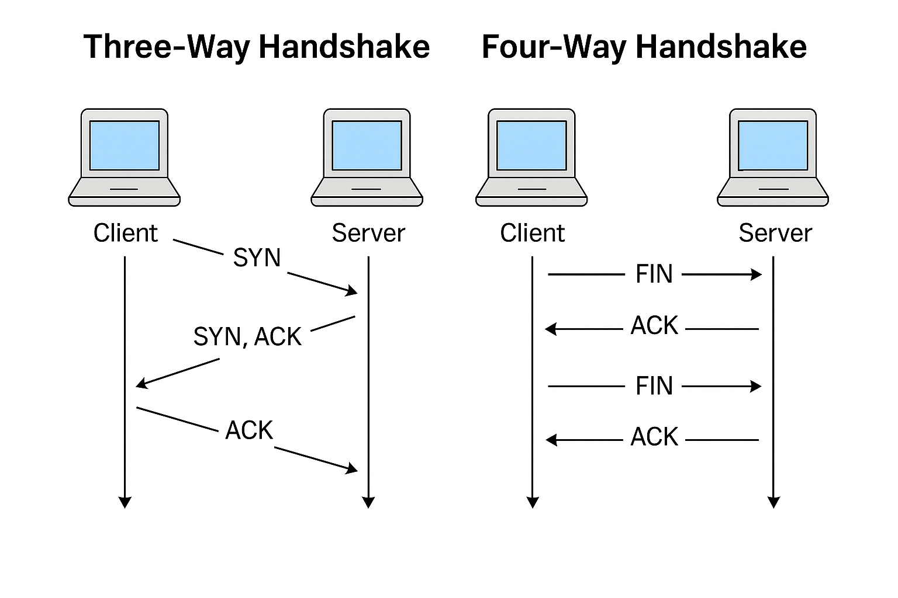

## 🧬 Network Data in OSI & TCP/IP Layers

Understanding what kind of data is handled at each OSI (and TCP/IP) layer is crucial for SOC analysts. Each layer adds or interprets specific information in a network packet, and certain fields are especially important for threat detection.

---

### OSI Model: Data & Key Packet Fields

| Layer | Data Type | Key Fields in Packets | Security Relevance |
|-------|-----------|----------------------|--------------------|
| **7. Application** | Application Data (HTTP, DNS, SMTP, etc.) | HTTP headers, DNS queries, email content | Malicious payloads, phishing, C2 traffic |
| **6. Presentation** | Encoded/Encrypted Data | SSL/TLS handshake, certificates, encoding type | Encrypted malware, SSL stripping |
| **5. Session** | Session Tokens, IDs | Session identifiers, cookies | Session hijacking, replay attacks |
| **4. Transport** | Segments (TCP), Datagrams (UDP) | Source/dest ports, sequence/ack numbers, flags (SYN, ACK, FIN), checksums | Port scans, SYN floods, data exfiltration |
| **3. Network** | Packets | Source/dest IP addresses, TTL, protocol, fragmentation info | IP spoofing, DDoS, routing attacks |
| **2. Data Link** | Frames | MAC addresses, frame type, VLAN tags, CRC | MAC spoofing, ARP poisoning, VLAN hopping |
| **1. Physical** | Bits/Signals | Voltage, light pulses, radio waves | Wiretapping, jamming |

---

### TCP/IP Model: Data & Key Packet Fields

| Layer | Data Type | Key Fields | Security Relevance |
|-------|-----------|------------|--------------------|
| **4. Application** | Application Data | Protocol-specific headers (HTTP, DNS, etc.) | Malware, phishing, C2 |
| **3. Transport** | Segments/Datagrams | Ports, flags, sequence numbers | Scanning, flooding |
| **2. Internet** | Packets | IP addresses, TTL, protocol | Spoofing, DDoS |
| **1. Network Interface** | Frames/Bits | MAC addresses, frame checks | LAN attacks |

---

### TCP vs UDP: Beginner Explanation

**TCP (Transmission Control Protocol):**
- Connection-oriented protocol using a 3-way handshake (SYN, SYN-ACK, ACK) to establish a reliable connection.
- Slower but ensures data arrives in order and without errors.
- Commonly used for web browsing, email, file transfers.
- Example: When you load a website, your browser uses TCP to ensure all data arrives correctly.

**UDP (User Datagram Protocol):**
- Connectionless protocol, does not establish a handshake.
- Faster but less reliable—packets may be lost or arrive out of order.
- Used for broadcast/multicast, streaming, VoIP, DNS queries.
- Example: Online games or video calls use UDP for speed, even if some data is lost.

---

### Example: Dissecting a TCP Packet

A typical TCP packet (Layer 4) contains:

- **IP Version:** IPv4 or IPv6.
- **Source Address & Destination Address:** IPs of sender and receiver.
- **Source Port & Destination Port:** Identify communicating applications.
- **Sequence & Acknowledgment Numbers:** Track data flow and order.
- **Flags:** Indicate communication status (see below).
- **Window Size:** Represents the size of the packet being transmitted; used for flow control.
- **Checksum:** Error detection.
- **Payload:** Actual data (may be encrypted or plain).

#### TCP Flags (Communication Status):

| Flag | Purpose | Beginner Explanation |
|------|---------|---------------------|
| **SYN** | Synchronization | Starts a connection; first step in handshake. |
| **ACK** | Acknowledge | Confirms receipt of data. |
| **FIN** | Finish | Requests to end a connection. |
| **RST** | Reset | Resets a failed connection. |
| **URG** | Urgent | Marks data as urgent for immediate processing. |
| **PSH** | Push | Requests immediate data delivery to the receiver. |

> **SOC Insight:**  
Unusual port numbers, repeated SYN flags, or malformed sequence numbers can indicate scanning or attack attempts.

---

### Example: Dissecting an IP Packet

An IPv4 packet (Layer 3) includes:

- **Source & Destination IP:** Who is sending/receiving.
- **TTL (Time To Live):** Limits packet lifetime.
- **Protocol:** Indicates next layer (TCP, UDP, ICMP).
- **Header Checksum:** Error checking.
- **Fragmentation Info:** If packet is split.

> **SOC Insight:**  
Spoofed IPs, low TTL values, or fragmented packets may signal evasion or DDoS tactics.

---

### Example: Ethernet Frame (Layer 2)

- **Destination & Source MAC:** Device addresses on local network.
- **EtherType:** Protocol type (e.g., IPv4, ARP).
- **Payload:** Encapsulated packet.
- **Frame Check Sequence (FCS):** Error checking.

> **SOC Insight:**  
Frequent MAC changes or ARP anomalies can indicate spoofing or man-in-the-middle attacks.

---

---

## 🛠️ Why These Fields Matter

SOC analysts inspect these fields to:

- Detect anomalies (e.g., port scans, spoofed addresses)
- Identify malicious payloads or command-and-control (C2) traffic
- Trace attack paths and reconstruct incidents

**Mastering packet structure and key fields at each layer is essential for effective network defense.**

---

**References:**
- [TCP and UDP Ports Explained (YouTube)](https://www.youtube.com/watch?v=uwoD5YsGACg&pp=ygUbdGNwIGFuZCB1ZHAgcG9ydHMgZXhwbGFpbmVk)
- [GeeksforGeeks: TCP Flags](https://www.geeksforgeeks.org/tcp-flags/)
